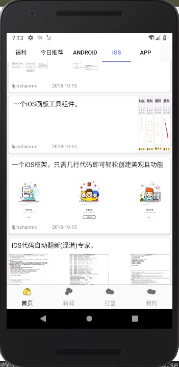
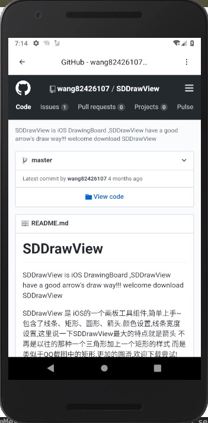
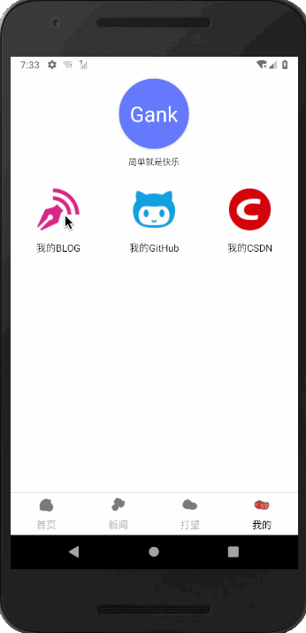
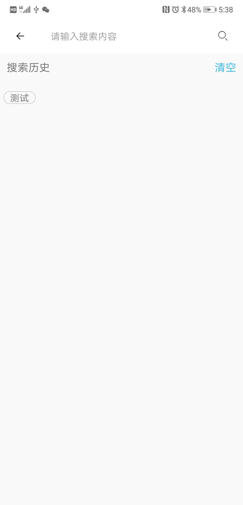
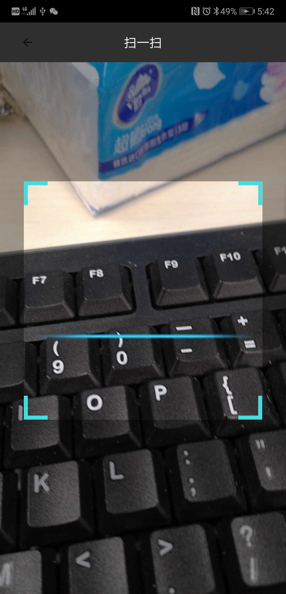

# 项目简介
这是一个自己练手的Android小项目，主要内容包含了Gank内容的接入，用到了我自己开源等

# APK 下载

# UI效果展示

  
  
  
  

 
  
  
  

 
  
  

# UI亮点
<li>沉浸式状态栏</li>
<li>可拖拽的RecyclerView</li>
<li>瀑布流照片墙</li>
<li>多类型Item RecyclerView</li>
<li>自定义View</li>

# 项目架构

# 开源依赖
[EasyStatueView](https://github.com/wintonBy/EasyStatueView)
我自己开源的状态布局 
[BottomNavigationView](https://github.com/wintonBy/BottomNavigationView)
我自己开源的底部导航 
[AppExecutor](https://github.com/wintonBy/AppExecutor)
我自己开源的应用线程管理器 
[BigImageViewer](https://github.com/Piasy/BigImageViewer)
大图查看器 
[Retrofit](https://github.com/square/retrofit)
网络框架 

