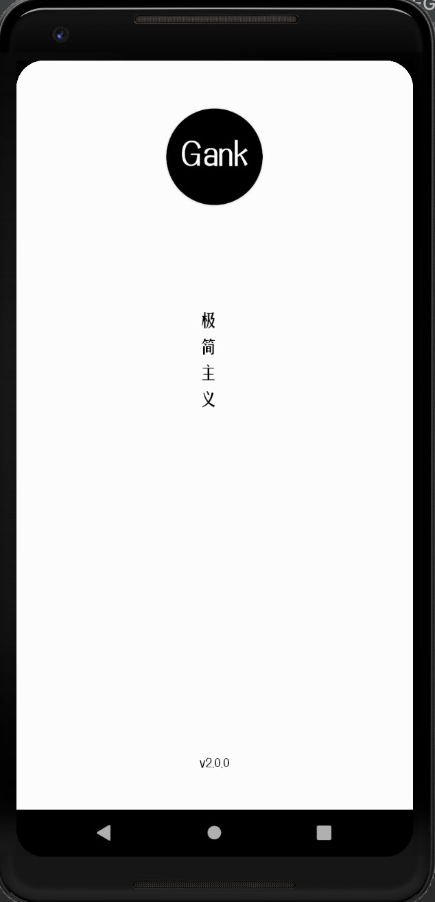

# 项目简介
这是一个自己练手的Android小项目，主要内容包含了Gank内容的接入，用到了我自己开源等
# UI效果展示

  
  
  
  

  
  
  

  

# 项目架构

# 开源依赖
<li>
[EasyStatueView](https://github.com/wintonBy/EasyStatueView)
</li>
<li>
[BottomNavigationView](https://github.com/wintonBy/BottomNavigationView)
</li>
<li>
[AppExecutor](https://github.com/wintonBy/AppExecutor)
</li>
<li>
[BigImageViewer](https://github.com/Piasy/BigImageViewer)
</li>

